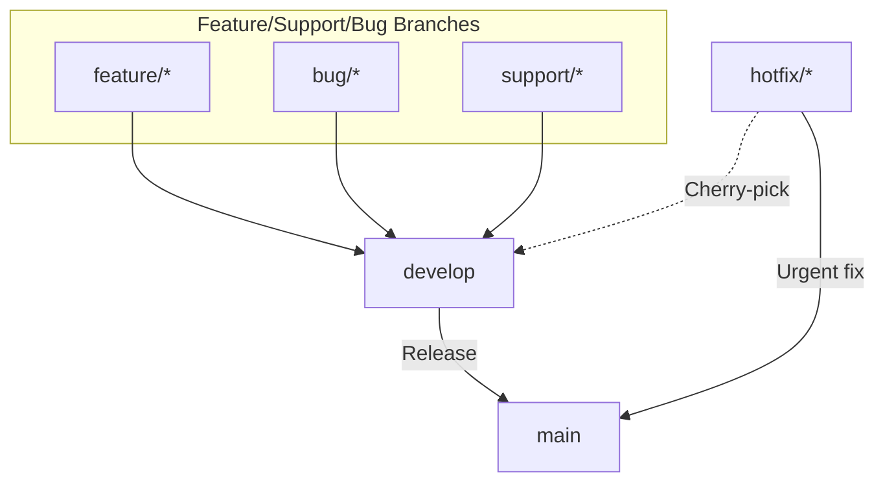

# GitHub Workflow

This document is an overview of the GitHub workflow used by the TPC project. It includes instuction about how to follow release and hotfix process.

## Branches

- main
- develop (default branch)
- feature/bug/hotfix/support

## Workflow Diagram



## Creating a Working Branch

Get your local develop branch up to date with the upstream develop branch:

```bash
git switch develop
git pull origin develop
```

Create a new branch for your work:

```bash
git switch -c <branch-name>
```

## Keep Your Local Branch Up to Date

```bash
git fetch origin
git rebase origin/develop
```

Git `fetch` and `rebase` are preferred over `pull` because they do not create a merge commit. Though `pull` is also acceptable.


## Commit and Push Your Changes

```bash
git add .
git commit -m "Commit message"
git push -u origin <branch-name>
```

## Creating a Pull Request

1. Click the Compare & Pull Request button next to your feature branch.
2. Select the develop branch as the base branch.
3. Get a code review from a team member.
4. After approval, merge the pull request using the squash and merge option.
5. The branch should be automatically deleted after the merge. If not, ensure that the branch is deleted manually.

## Release Process

1. Create a new branch from the develop branch.
2. Create a Pull Request from the new branch to the main branch.
3. Merge the Pull Request using the merge commit option. This ensures all the commits are present in the main branch.
4. Delete the branch after the merge.

## Hotfix Process (Cherry Pick)

1. Create a new branch from the main branch.
2. Push your changes to the main branch.
3. Cherry pick the commit to the develop branch. (Should only be done by a maintainer with write access to the develop branch)

```bash
git switch develop
git cherry-pick <commit-hash>
git push origin develop
```